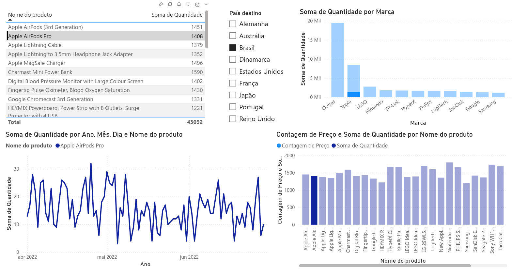

# Análise de Vendas (SQL + Power BI)

## Objetivo
Praticar análise de dados utilizando SQL para exploração e transformação dos dados, e Power BI para construção de visualizações.

---

## Estrutura dos dados
- `produtos.csv`: lista de produtos com código, nome e preço  
- `vendas.csv`: registros de vendas com quantidade, data, país de envio e outras informações  

---

## Como reproduzir

1. Criar banco SQLite (`vendas.db`)  
2. Criar tabelas `produtos` e `vendas`  
3. Importar os arquivos CSV  
4. Executar as queries presentes em `queries.sql`  

---
## Análises realizadas

As análises abaixo foram implementadas em SQL e refletidas nas visualizações do dashboard:

- Total de vendas por dia  
- Valor total vendido por produto (join entre vendas e produtos)  
- Produtos com preço acima da média geral  
- Classificação de produtos por faixa de preço (CASE)  
- Quantidade de vendas por país e produto  
- Média de preço por marca (com agrupamento e filtro)  
- Identificação de pedidos com status de envio ausente (NULL)  

---

## Dashboard

Os dados foram utilizados no Power BI para criação das visualizações, incluindo:

- Evolução da quantidade de vendas ao longo do tempo (linha)  
- Filtro por país de destino  
- Tabela de produtos com quantidade vendida  
- Gráfico de barras: quantidade por marca  
- Gráfico de barras: produto por preço e quantidade  

### Preview

Arquivo do dashboard disponível em:
`/powerbi/dashboard_vendas.pbix`

---

## Tecnologias utilizadas

- SQL (SQLite)  
- Power BI  

---

## Observações
O Power BI foi utilizado para complementar a análise feita em SQL, permitindo uma visualização mais clara dos dados e dos insights gerados.
